# 🎭 THE ROUNDTABLE

**Your Personal Board of Directors, Powered by AI.**

> **Submitted for:** Google AI Agents Intensive - Capstone Project (Freestyle Track)  
> **Built with:** LangGraph, Google Gemini, Streamlit

---

## 🎯 The Problem

Making important life and career decisions is hard. We often face:
- **Decision fatigue** from analyzing complex choices alone
- **Echo chambers** where we only hear confirming opinions
- **Data overload** from scattered information (calendars, notes, finances)
- **Blind spots** in our thinking that lead to poor outcomes

Traditional solutions (talking to friends, pros/cons lists) lack:
- Systematic analysis of your actual data
- Diverse perspectives (optimist vs. realist)
- Accountability and structured decision-making

## 💡 The Solution

**THE ROUNDTABLE** is a multi-agent AI system that simulates a **personal board of directors** to help you make better decisions. It:

1. **Gathers your data** - Analyzes your calendar, projects, and goals (simulated via Notion/Calendar)
2. **Researches context** - Performs intelligent web searches when external data is needed
3. **Debates intelligently** - Three AI agents with distinct personas discuss your question:
   - **Aria (Visionary)**: Highlights opportunities and upside potential
   - **Marcus (Skeptic)**: Identifies risks using your actual data
   - **The Chair**: Synthesizes both views into a balanced recommendation
4. **Delivers clarity** - Presents a final **SUPPORT** or **OPPOSE** decision with reasoning

### Why Agents?

Agents uniquely solve this problem because:
- **Multi-perspective analysis**: Sequential agents provide diverse viewpoints automatically
- **Data grounding**: Agents can access and reference your real information (tools integration)
- **Iterative refinement**: Loop-based debate allows ideas to be challenged and improved
- **Contextual intelligence**: Each agent maintains role consistency across conversation rounds

---

## 🧠 The Agents

| Agent | Persona | Role | Temperature |
|-------|---------|------|-------------|
| **👔 Chief of Staff** | *The Organizer* | Gathers context from your data and performs intelligent web searches | 0.1 (analytical) |
| **🚀 Aria** | *The Visionary* | Proposes bold, optimistic solutions focused on maximum upside | 0.9 (creative) |
| **🔍 Marcus** | *The Skeptic* | Critiques proposals using hard data (budget, deadlines, conflicts) | 0.3 (analytical) |
| **⚖️ The Chair** | *The Moderator* | Synthesizes arguments and makes the final **SUPPORT** or **OPPOSE** decision | 0.7 (balanced) |

---

## 🏗️ Architecture

### Agent Workflow

```mermaid
graph TD
    User([👤 User Question]) --> Start
    Start --> Chief[👔 Chief of Staff]
    
    subgraph Context["🔍 Context Gathering Phase"]
        Chief -->|Analyze Request| Decision{Need External Data?}
        Decision -->|Yes| Web[🌐 Web Search via Gemini]
        Decision -->|No| Internal[📂 Notion + Calendar Data]
        Web --> Context1[📊 Context Report]
        Internal --> Context1
    end
    
    Context1 --> Aria[🚀 Aria - Visionary]
    
    subgraph Debate["💬 Debate Phase (max 3 rounds)"]
        Aria -->|Bold Proposal| Marcus[🔍 Marcus - Skeptic]
        Marcus -->|Data-Driven Critique| Chair[⚖️ The Chair]
        Chair -->|Needs More Info?| RoundCheck{Round < 3?}
        RoundCheck -->|Yes| Aria
    end
    
    Chair -->|Final Decision| Final{Verdict}
    Final -->|✅| Support([SUPPORT - Approved])
    Final -->|❌| Oppose([OPPOSE - Rejected])
    Final -->|⚠️| Conditional([SUPPORT with Conditions])
```



### State Management

```python
class BoardState(TypedDict):
    messages: Annotated[List, add_messages]  # Conversation history
    context_data: Dict[str, Any]             # Notion/Calendar/Web data
    round_count: int                          # Debate iteration tracker
    status: Literal["gathering", "debating", "approved", "max_rounds"]
```

**Key Features:**
- **Persistent state**: AsyncSqliteSaver for checkpointing (`roundtable_demo.db`)
- **Session isolation**: Unique thread IDs per debate to prevent state carryover
- **Conditional loops**: Chair can request revision, triggering new debate round

---

## 🚀 Getting Started

### Prerequisites
- Python 3.10+
- Google Gemini API Key ([Get one here](https://ai.google.dev/))

### Installation

1. **Clone the repository**
   ```bash
   git clone https://github.com/AdithyanMP2002/The-RoundTable.git
   cd the-roundtable
   ```

2. **Install dependencies**
   ```bash
   pip install -r requirements.txt
   ```

3. **Set up credentials**
   Create a `.env` file in the root directory:
   ```env
   GOOGLE_API_KEY=your_gemini_api_key_here
   MAX_DEBATE_ROUNDS=3
   ```

4. **Run the application**
   ```bash
   streamlit run streamlit_app.py
   ```

5. **Open your browser** to `http://localhost:8501`

### Example Questions to Try

**Positive decisions (likely SUPPORT):**
- "Should I learn Python programming to advance my career?"
- "Is it worth taking a public speaking course?"

**Negative decisions (likely OPPOSE):**
- "Should I quit my job tomorrow to become a day trader with no experience?"
- "Should I invest my entire savings in cryptocurrency?"

**Nuanced decisions (debate):**
- "Should I take a 50% pay cut to work at a startup I'm passionate about?"
- "Is it time to take a 6-month sabbatical to travel?"

---

## 📂 Project Structure

```
the-roundtable/
├── src/
│   ├── backend.py              # Core LangGraph workflow & agent nodes
│   ├── agents.py               # Agent model initialization
│   ├── system_instructions.py  # Agent persona definitions
│   ├── tools.py                # Notion/Calendar tool definitions
│   ├── mock_data.py            # Simulated data for testing
│   └── graph.py                # Alternative graph implementation
├── streamlit_app.py            # Streamlit UI with animations
├── requirements.txt            # Python dependencies
├── .env.example                # Environment variables template
└── README.md                   # This file
```

---

## 🛠️ Tech Stack

| Component | Technology | Purpose |
|-----------|-----------|---------|
| **Orchestration** | LangGraph | Multi-agent workflow with conditional loops |
| **LLM** | Google Gemini 2.0 Flash Lite | Fast, cost-effective inference |
| **State Management** | AsyncSqliteSaver | Persistent checkpointing for debate sessions |
| **Frontend** | Streamlit | Real-time UI with agent status animations |
| **Tools** | Custom (Notion/Calendar) | Data grounding for agent decisions |
| **Retry Logic** | Tenacity | Exponential backoff for API rate limits |

---

## 📸 Screenshots

### Main Interface
![Streamlit UI showing debate flow]
*Interactive debate visualization with agent status indicators*

### Decision Output
![Decision box showing OPPOSE verdict]
*Final recommendation with reasoning from The Chair*

---

## 🧪 Features Implemented (Hackathon Requirements)

✅ **Multi-Agent System**: 4 agents (Chief, Aria, Marcus, Chair) with sequential + loop flow  
✅ **Tools**: Custom Notion/Calendar tools + web search integration  
✅ **State Management**: LangGraph StateGraph with AsyncSqliteSaver  
✅ **Context Engineering**: Intelligent context summarization and compaction  
✅ **Observability**: Python logging + Streamlit real-time visualization  
✅ **Error Handling**: Tenacity retry logic with exponential backoff  

---

## 🎓 Course Learnings Applied

This project demonstrates key concepts from the **5-Day AI Agents Intensive**:

1. **LangGraph Workflows** - Sequential and conditional agent orchestration
2. **Tool Integration** - Custom tools for data grounding
3. **State Management** - Persistent checkpointing with SQLite
4. **Agent Personas** - Role-based system instructions with temperature control
5. **Error Handling** - Retry logic for production resilience

---

## 🔧 Troubleshooting

### API Rate Limits
If you hit quota limits, the system will automatically retry with exponential backoff. You'll see:
```
⚠️ Rate limit hit. Cooling down for X seconds...
```

### Empty Agent Responses
If an agent fails to respond, the system provides default fallback responses to continue the debate.

### Database Locks
If you encounter SQLite errors, delete `roundtable_demo.db` and restart:
```bash
rm roundtable_demo.db
streamlit run streamlit_app.py
```

---

## 🚀 Future Enhancements

- **Real MCP Integration**: Connect to actual Notion/Google Calendar APIs
- **Memory Bank**: Long-term memory of past decisions for consistency
- **Agent Evaluation**: Automated testing with decision quality metrics
- **Cloud Deployment**: Deploy to Google Cloud Run or Agent Engine
- **Voice Interface**: Audio input/output for natural interaction

---

## 📜 Version History

### V1-Local (Current - Dec 1, 2025)
- Full 4-agent debate workflow (Chief, Aria, Marcus, Chair)
- Local data simulation (Notion/Calendar mock data)
- Intelligent web search integration
- Streamlit UI with agent status animations
- Robust error handling and retry logic
- SQLite-based state persistence

---

## 📄 License

MIT License - feel free to use and modify for your own projects!

---

## 👤 Author

**Adithyan MP**  
Built for Google AI Agents Intensive - Capstone Project (Freestyle Track)  
GitHub: [@AdithyanMP2002](https://github.com/AdithyanMP2002)
